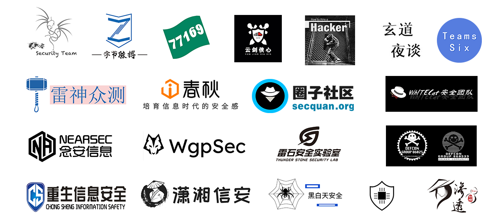
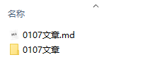

#### 团队简介

------

网络安全团队创建于2020年8月，由安全行业爱好者组成。团队的核心思想，开源，公益，共享。

技术远离条条框框，我们一直都在路上。

扫描二维码，关注我们


#### 文库简介

------

早期安全技术圈环境封闭，割韭菜之风盛行。为实现技术共享，交流便利，2020年6月漏洞文档应运而生，主要收集互联网公开的高风险漏洞POC/EXP，使企业自查漏洞更加便利，白帽子们可以更加省心保卫国家网络安全。


#### 合作伙伴

------




#### 投稿方式

------

##### 投稿地址

kukuqi666@gmail.com

##### 投稿内容要求

文库目前仅收录近几年内“较新”的漏洞，尽可能的保证文库使用时的实用性。较远时期例如5年前的漏洞将不再收录。

##### 贡献文档要求

当你打算贡献某部分的内容时，你应该尽量确保

- 文档内容满足基本格式要求
- 文档的合理性以及准确性
- 文档图片以及附件的存储格式

##### 文档存储格式

1.目前仓库只接受 Markdown 格式的贡献提交，如果有其他格式的提交请联系我们进行转换。

2.文章内图片存储要求：如果文章内有图片演示等，应将图片放在本地，避免使用外链。推荐使用相对路径进行图片索引链接，复制图片到与当前文档同名的文件夹下，或可直接在 MarkDown 软件中设置复制图片到指定路径，图片存储位置策略代码如下：

```
./${filename}
```

其中 `./${filename}` 表示当前文件名，具体案例演示如下：

假设我有一篇名为`xss 技术总结.md` 的文章，里面有若干图片，那么图片应该存储在 `xss 技术总结` 这个文件夹内，提交时应当将此文件夹和 .md 文件一同提交。

##### 示例




#### 相关说明

------

漏洞文档均来自网络文章综合、团队原创以及白帽子投稿，对于有可溯来源的文章我们将会注明来源，对引用参考内容的文章，我们将会在每篇文章末标注引用参考来源。如有文章来源和参考链接更新不及时的情况，请各位及时批评指正。


